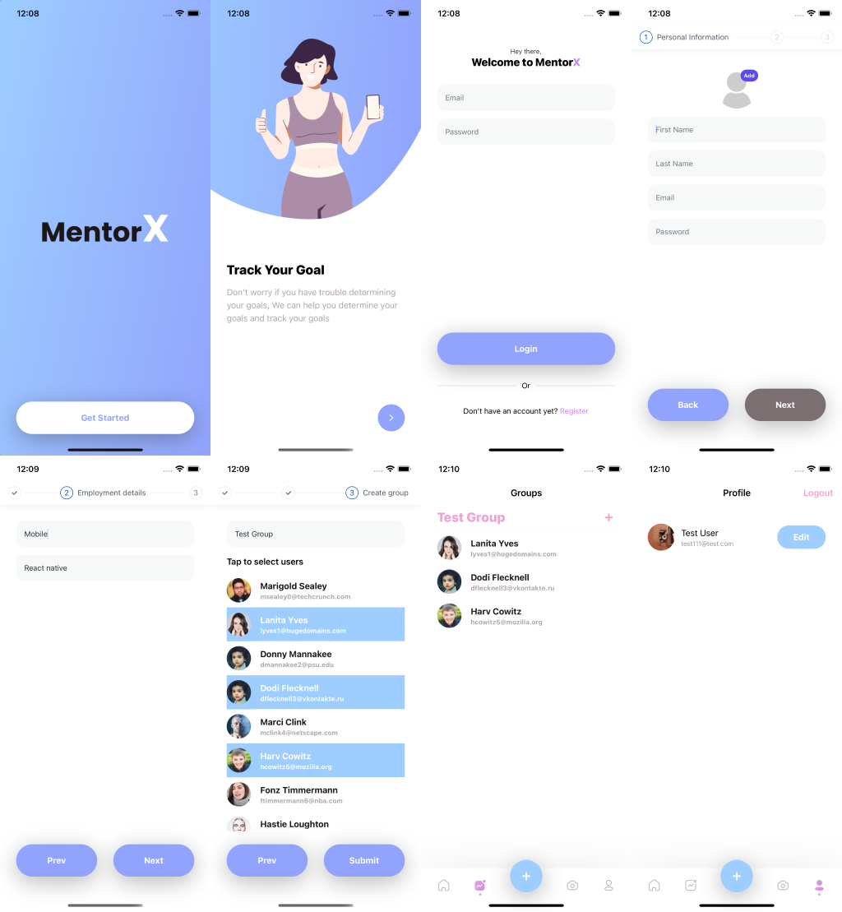

# MentorX Demo app

### Dependencies
- [React-native (66.4)](https://reactnative.dev/docs/0.66/getting-started)
- [Redux-exodus (for state management)](https://bayazetyan.github.io/redux-exodus/docs/get-started)
- [Firebase (for storage)](https://rnfirebase.io/)
- [RNUI (for save development time)](https://wix.github.io/react-native-ui-lib/)
- [React Native navigation (Full native support)](https://wix.github.io/react-native-navigation/docs/before-you-start/)

### Actual functionality
 - Authorization/Registration
 - Upload avatar
 - Create group
 - Change Avatar
 - Update Profile (in progress)

### Demo design

